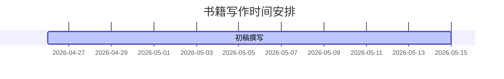

# DeepLearningBookWriting

关于写作规范及相关资源，见`writing`目录。

## 时间安排

## 信息收集

### 分工

范瑞龙：1-深度学习历史，2-人工神经网络

王纪元：3-卷积神经网络，4-卷积网络的进化

刘源：5-循环神经网络，6-自编码器

苏萌：7-搭建自己的深度学习框架

张志伟：8-深度学习系统，9-如何构建应用

王璇：10-优化算法分析

吴波：11-调参策略

覃一航：12-迁移学习

伊浩源：13-生成对抗网络

张江源：14-深度学习真的是黑盒么

张译：15-图神经网络

王旭：16-从注意力机制到BERT

### 大纲

[腾讯文档 - 深度学习-结构](https://docs.qq.com/doc/DRnZYUEpxak9VWExG)

### 信息/问题收集

对于写作规范方面的问题，通过这些渠道反馈：

1. 直接私我
2. 在仓库里提issue

### 供参考的资源

#### 课程

- [CMSC5711 Image Processing and Computer Vision](http://www.cse.cuhk.edu.hk/~khwong/www2/cmsc5711/cmsc5711.html)
- [CS230 Deep Learning](https://cs230.stanford.edu/)
  - [CS230 PyTorch Code Examples](https://cs230.stanford.edu/blog/pytorch/)
  - [CS230 Project](https://cs230.stanford.edu/project/)
- [CSC 321 Intro to Neural Networks and Machine Learning](https://www.cs.toronto.edu/~rgrosse/courses/csc321_2018/)
- [CMU-10707 - Deep Learning](https://deeplearning-cmu-10707-2022spring.github.io/)

#### 其他

- [Blog - Calculus on Computational Graphs: Backpropagation](https://colah.github.io/posts/2015-08-Backprop/) 计算图、反向传播
- [YouTube - 李宏毅 Computational Graph & Backpropagation](https://www.youtube.com/watch?v=-yhm3WdGFok) 计算图、反向传播
- （已失效）[Machine learning models on a remote Hadoop cluster](https://www.ibm.com/docs/en/dselcv?topic=data-machine-learning-models-hadoop)
- [GitHub - HuaizhengZhang/Awesome-System-for-Machine-Learning](https://github.com/HuaizhengZhang/Awesome-System-for-Machine-Learning)：一些机器学习系统相关研究的精选，以及论文笔记
- [Blog - CSE 599W 课程笔记](https://jcf94.com/2018/10/04/2018-10-04-cse559w/)
- [Blog - Deep Learning on Hadoop 2.0](https://medium.com/paypal-tech/deep-learning-on-hadoop-2-0-16b4db3c65dc)
- [Blog - 一文读懂Depthwise卷积](https://blog.csdn.net/weixin_44106928/article/details/103079668)
- [Blog - Evolution of Graph Computation and Machine Learning](https://towardsdatascience.com/evolution-of-graph-computation-and-machine-learning-3211e8682c83) 
- [Deep Learning From Scratch: Theory and Implementation](https://www.codingame.com/playgrounds/9487/deep-learning-from-scratch---theory-and-implementation/computational-graphs)
- [Deep Learning From Scratch I: Computational Graphs](https://www.sabinasz.net/deep-learning-from-scratch-i-computational-graphs/) 计算图
- [Computational Graphs](https://www.tutorialspoint.com/python_deep_learning/python_deep_learning_computational_graphs.htm) 计算图
- [Dynamic vs Static Computational Graphs – PyTorch and TensorFlow](https://www.geeksforgeeks.org/dynamic-vs-static-computational-graphs-pytorch-and-tensorflow/?ref=rp) 动态、静态计算图
- [Blog - On chain rule, computational graphs, and backpropagation](http://outlace.com/on-chain-rule-computational-graphs-and-backpropagation.html) 链式法则、计算图、反向传播
- [Computational Graphs in Deep Learning](https://www.geeksforgeeks.org/computational-graphs-in-deep-learning/) 计算图
- [StackExchange - What is a Dynamic Computational Graph?](https://ai.stackexchange.com/questions/3801/what-is-a-dynamic-computational-graph) 动态计算图
- [GitHub - v-iashin/CS231n](https://github.com/v-iashin/CS231n) PyTorch/Tensorflow solutions for Stanford's CS231n: "CNNs for Visual Recognition"
- [Blog - Hyperparameter Tuning in Python: a Complete Guide](https://neptune.ai/blog/hyperparameter-tuning-in-python-complete-guide) 调参指南
- [Blog - Understanding Graph Convolutional Networks for Node Classification](https://towardsdatascience.com/understanding-graph-convolutional-networks-for-node-classification-a2bfdb7aba7b) 图卷积网络
- [Blog - Graph Convolutional Networks](https://tkipf.github.io/graph-convolutional-networks/) 图卷积网络
- [Blog - 深度学习发展史](https://blog.csdn.net/fendouaini/article/details/79788106)
- [OPEN MLSYS 机器学习系统：设计和实现](https://openmlsys.github.io/index.html) 开源书籍
